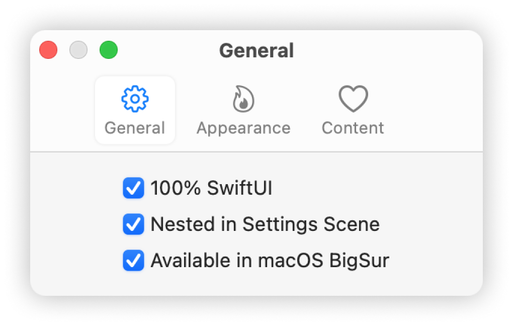
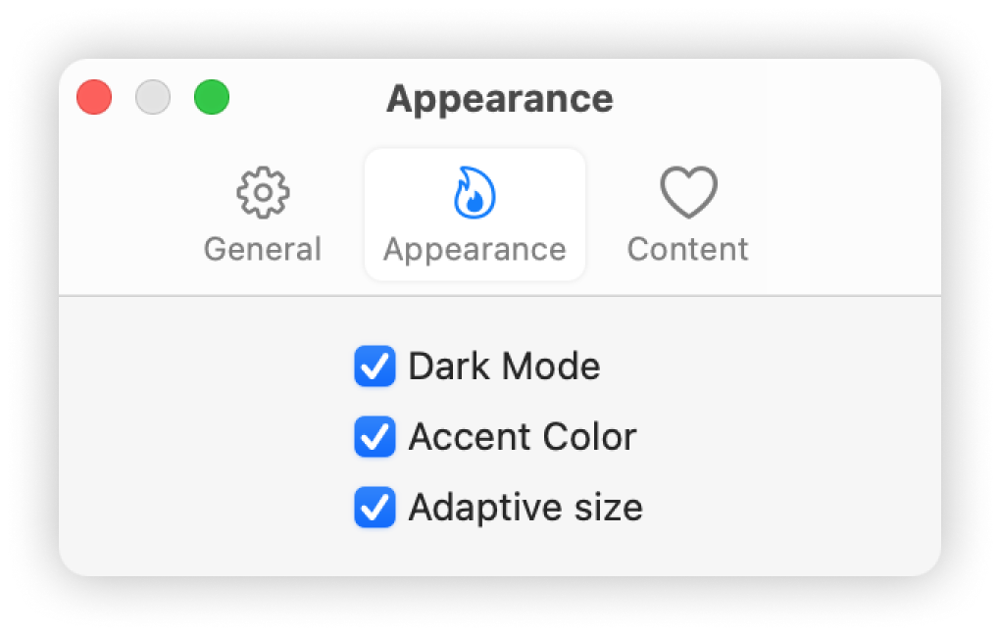
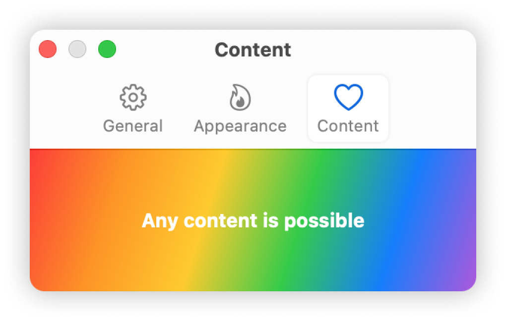

## MacSettings

Mac Settings SwiftUI View

<p float="left">
  
  
  
</p>

## Usage

```swift
import SwiftUI
import MacSettings

@main
struct MainApp: App {
    @SceneBuilder
    var body: some Scene {
        WindowGroup {
            ContentView()
        }
        Settings {
            MacSettings {
                MacSettingsItem(title: "General",
                                image: "gearshape",
                                content: generalSettings)
                MacSettingsItem(title: "Location",
                                image: "location",
                                content: locationSettings)
                MacSettingsItem(title: "Cloud",
                                image: "cloud",
                                content: cloudSettings)
            }
        }
    }
    
    var generalSettings: some View { ... }
    var locationSettings: some View { ... }
    var cloudSettings: some View { ... }
}
```
