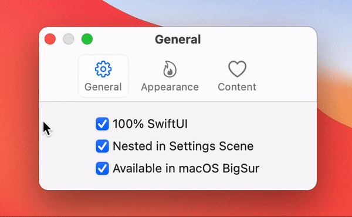

## MacSettings

Mac Settings SwiftUI View

## Example

<center>

</center>
<center>

</center>
<center>

</center>
<center>

</center>


## Usage

```swift
import SwiftUI
import MacSettings

@main
struct MainApp: App {
    @SceneBuilder
    var body: some Scene {
        WindowGroup {
            ContentView()
        }
        Settings {
            MacSettings {
                MacSettingsItem(title: "General",
                                image: "gearshape",
                                content: generalSettings)
                MacSettingsItem(title: "Appearance",
                                image: "flame",
                                content: appearanceSettings)
                MacSettingsItem(title: "Content",
                                image: "heart",
                                content: contentSettings)
            }
        }
    }
    
    var generalSettings: some View { ... }
    var appearanceSettings: some View { ... }
    var contentSettings: some View { ... }
}
```
